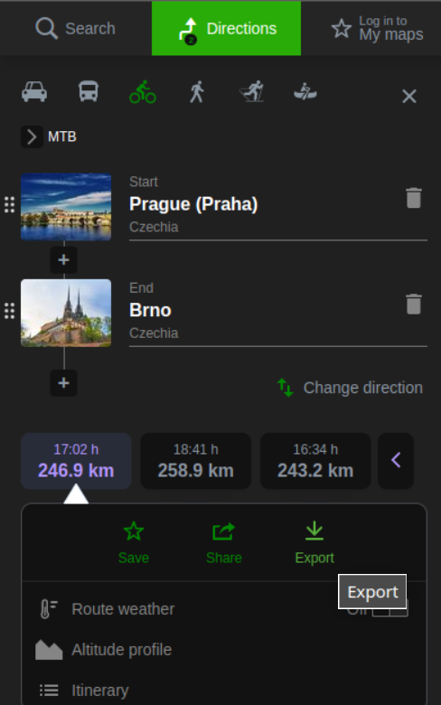
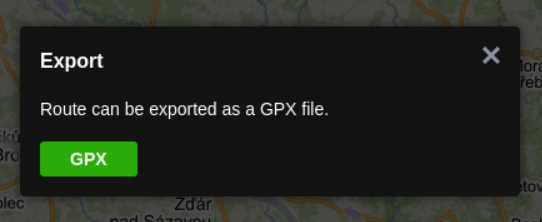

# GPXgenerator

- tool for adding timestamp to gpx waypoint files, to fake forgotten gps track files

## Usage

- add waypoints in mapy.cz



- export gpx



- calculate timestamp of activity start for example on:

https://www.unixtimestamp.com/

- generate gpx file:

```
python generate.py waypoints_file.gpx start_timestamp speed
```
